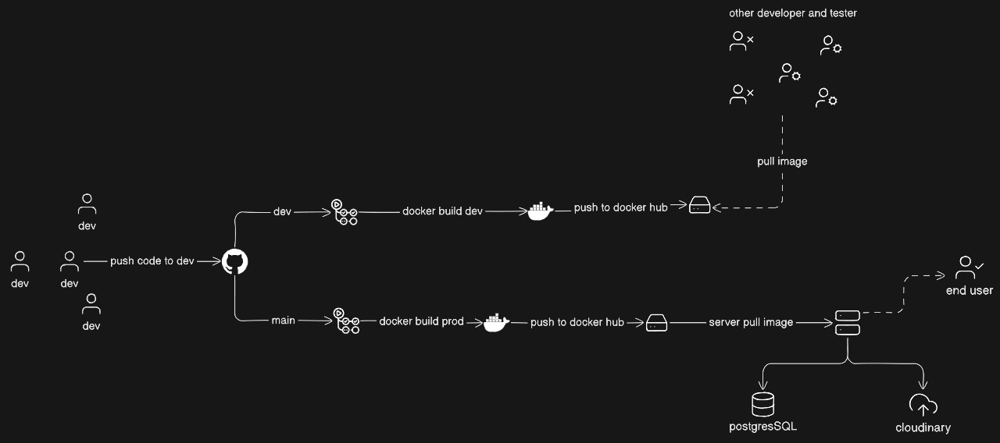

# PhotoSeekAI - Facial Recognition and Photo Management API

PhotoSeekAI is a streamlined API built for efficient facial recognition and photo organization. It is ideal for large photo collections from events like weddings, family gatherings, or celebrations, and leverages advanced machine learning techniques to find and manage faces within your photo gallery.

The API is built using Flask and PostgreSQL with a structured Blueprint architecture, ensuring high performance and scalability. It also integrates with CI/CD pipelines using GitHub Actions and DockerHub to automate deployments and maintain a robust development workflow.

## Getting Started

To set up and run PhotoSeekAI, follow these steps:

### Setting Up a Virtual Environment
Create a new virtual environment using Python:
```sh
python -m venv venv
```

### Activating the Virtual Environment
On Windows:
```sh
.\venv\Scripts\activate
```

### Installing Dependencies
Once the virtual environment is active, install all required packages:
```sh
pip install -r requirements.txt
```

### Deactivating the Virtual Environment
To deactivate the virtual environment, simply type:
```sh
deactivate
```

### Saving Dependencies
Before sharing your project, save all package dependencies with:
```sh
pip freeze > requirements.txt
```

## API Overview
PhotoSeekAI offers various endpoints to handle face data and user authentication. Key features include:
- **User Authentication**: Secure login, signup, and profile management.
- **Face Data Handling**: Upload images, perform facial recognition, and organize images by specific individuals.

## PostgreSQL Database Schema
To give you a better understanding of how data is structured, here is an overview of the PostgreSQL schema used in PhotoSeekAI:


The schema outlines how user data, face features, and project details are managed efficiently.

## Continuous Integration and Deployment (CI/CD)
PhotoSeekAI employs a robust CI/CD pipeline using GitHub Actions and DockerHub. This setup ensures seamless integration and deployment, allowing for automated testing, building, and deployment of new changes. Here’s a diagram illustrating the workflow:



This CI/CD setup streamlines the development process, making it easier to maintain and deploy updates.

## Conclusion
PhotoSeekAI is designed to simplify photo management through intelligent facial recognition. With its secure and scalable architecture, this API is well-suited for applications requiring efficient photo search and organization. The integration of a CI/CD pipeline ensures that updates are handled reliably and efficiently.
